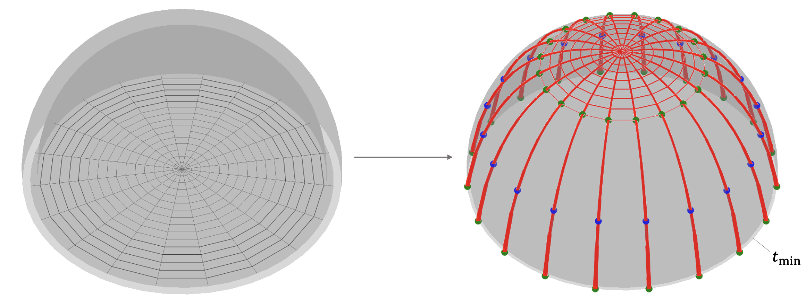

**********************
Dome minimum thickness
**********************

.. _example-dome-1:

The current example finds minimum thrust for a dome based a radial Form Diagram.

.. literalinclude:: ../../examples/_tutorial/4_dome_minthk.py
