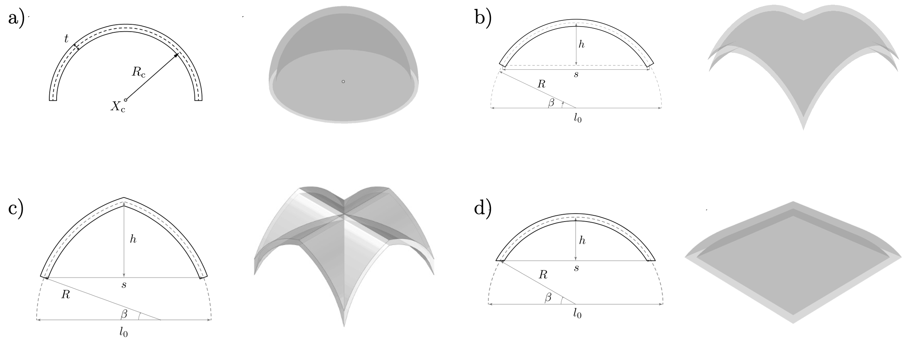

.. _envelope:

********************************************************************************
Envelope
********************************************************************************

.. currentmodule:: compas_tna.envelope

.. currentmodule:: compas_tna.envelope.Envelope

.. highlight:: python

This tutorial provides a quick tour of the generation of :mod:`Envelope <compas_tna.envelope.Envelope>`.

The Envelope can be created through a series of methods. It include three subclasses:

* :mod:`MeshEnvelope <compas_tna.envelope.MeshEnvelope>`: create the Envelope by providing meshes representing the intrados and extrados.
* :mod:`ParametricEnvelope <compas_tna.envelope.ParametricEnvelope>`: create the Envelope by providing a parametric definition of the envelope.
* :mod:`BrepEnvelope <compas_tna.envelope.BrepEnvelope>`: create the Envelope by providing a brep definition of the envelope.

The Parametric Envelopes is based on commom layouts which will be described herein.

Parametric Envelopes
--------------------

Each parametric envelope has a separated class. The methods to create each of these envelopes is described herein.

a) :class:`DomeEnvelope <compas_tna.envelope.DomeEnvelope>`: hemispheric dome geometry defined from its radius :math:`R`, thickness :math:`t`, center position :math:`[x_\mathrm{c}, y_\mathrm{c}]`, etc. One example is presented below:

.. code-block:: Python

    from compas_tna.envelope import DomeEnvelope
    envelope = DomeEnvelope(center=(5.0, 5.0),
                           radius=5.0,
                           thickness=0.5,
                           r_oculus=0.75,
                           n_hoops=24,
                           n_parallels=40)

b) :class:`CrossVaultEnvelope <compas_tna.envelope.CrossVaultEnvelope>`: rounded cross vault geometry defined from the span :math:`s`, thickness :math:`t`, corner positions :math:`[[x_\mathrm{0}, y_\mathrm{0}], [x_\mathrm{f}, y_\mathrm{f}]]`. One example is presented below:

.. code-block:: Python

    from compas_tna.envelope import CrossVaultEnvelope
    envelope = CrossVaultEnvelope(x_span=(0.0, 10.0),
                                 y_span=(0.0, 10.0),
                                 thickness=0.5,
                                 n=100)

c) :class:`PointedVaultEnvelope <compas_tna.envelope.PointedVaultEnvelope>`: pointed cross vault geometry defined from the span :math:`s`, thickness :math:`t`, corner positions :math:`[[x_\mathrm{0}, y_\mathrm{0}], [x_\mathrm{f}, y_\mathrm{f}]]`, height of center point :math:`h_\mathrm{c}`, and height of the boundary points :math:`h_\mathrm{b}`. One example is presented below:

.. code-block:: Python

    from compas_tna.envelope import PointedVaultEnvelope
    envelope = PointedVaultEnvelope(x_span=(0.0, 10.0),
                                   y_span=(0.0, 10.0),
                                   thickness=0.5,
                                   hc=7.0,
                                   he=[6.0, 6.0, 6.0, 6.0],
                                   n=100)

d) :class:`PavillionVaultEnvelope <compas_tna.envelope.PavillionVaultEnvelope>`: rounded pavillion vault geometry defined from the span :math:`s`, thickness :math:`t`, springing angle :math:`\beta`, corner positions :math:`[[x_\mathrm{0}, y_\mathrm{0}], [x_\mathrm{f}, y_\mathrm{f}]]`. One example is presented below:

.. code-block:: Python

    from compas_tna.envelope import PavillionVaultEnvelope
    envelope = PavillionVaultEnvelope(x_span=(0.0, 10.0),
                                     y_span=(0.0, 10.0),
                                     thickness=0.5,
                                     spr_angle=30.0,
                                     n=100)

To further explore the library of parametric envelopes, check the :mod:`Envelope <compas_tna.envelope>` full documentation.

Masonry Viewer
--------------

For 3D visualisation, the :class:`MasonryViewer <compas_masonry.viewers.MasonryViewer>` can be used. This `COMPAS View` based visualisation enable to add multiple 3D objects in the scene, such as the envelope, the thrust network, cracks, reaction forces, loads, etc. The viewer is used in the :ref:`examples <examples>` of this tutorial. The code to visualise the envelope of a crossvault is:

.. code-block:: Python

    from compas_masonry.viewers import MasonryViewer
    from compas_tna.envelope import CrossVaultEnvelope
    envelope = CrossVaultEnvelope(x_span=(0.0, 10.0),
                                 y_span=(0.0, 10.0),
                                 thickness=0.5,
                                 n=100)
    view = MasonryViewer(envelope=envelope)
    view.setup()
    view.show()
